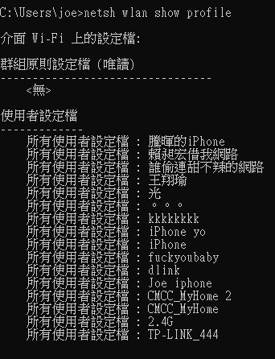
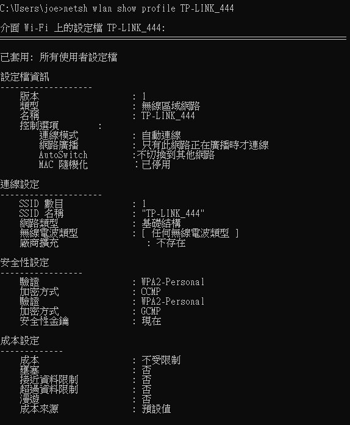
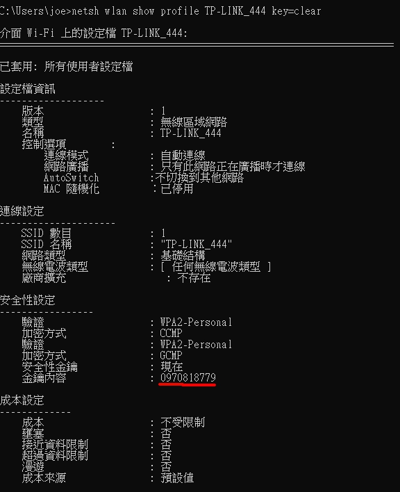

# 能夠取得本機WIFI名稱以及密碼

## 必須在python3.7+環境執行

### 指令: netsh wlan show profile

### 指令: netsh wlan show profile (輸入查找wifi名稱)

### 指令: netsh wlan show profile (輸入查找wifi名稱) key=clear

[資料來源](https://www.youtube.com/watch?v=SzYKzAHsdMg&t=411s) By. David Bombal 
